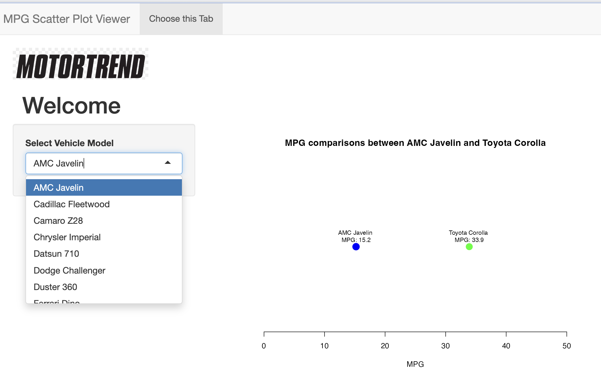

```{r setup, include=FALSE}
knitr::opts_chunk$set(echo = FALSE)
```

## Welcome
This presentation compares car fuel efficiency using a Shiny app created in R. This presentation explains the concept behind the Data Product and shows examples of the User Interface and code needed to run calculations in real time to generate a data visualization.

### The Concept

Remember that dataset that keeps on giving in datascience courses. We're talking about the amazing mtcars data. Plotting and visualizing all those data points in scatterplots? Nothing like that is needed anymore with the Motortrend User Interface (UI)?


Simply select the Vehicle Model of your choice from mtcars and it will be displayed on a plot realtive to the Vehicle with the greatest fuel efficiency, measure in miles per gallon (MPG). Sorry Vovlo owners, the Toyota Carolla is the leader. We've placed labeled markers of your chosen vehicle's MPG and the Toyota.


Sometimes it's easier to understand things one car at a time. The data product "Motortrend UI" meets your need for simplicity and clarity in data visualization of fuel efficiency.

You're welcome!

## The Shiny App - Part 1
Reaching the app is via the "Choose this Tab" - we're subtle with the UI. Infact, the Tab feature isn't really needed but we thought we'd demsonatrate it.
```{r}
library(shiny)

# Your Shiny app code here
# ui.R

library(shiny)

navbarPage("MPG Scatter Plot Viewer",
           
           tabPanel("Choose this Tab",
                    fluidPage(
                      tags$div(
                        tags$img(src = "www/images/motortrend-logo.png"),
                        headerPanel("Welcome"),
                        sidebarLayout(
                          sidebarPanel(
                            selectInput("model", "Select Vehicle Model", choices = sort(rownames(mtcars))),
                            # Use all row names of mtcars as choices, sorted alphabetically
                          ),
                          
                          mainPanel(
                            plotOutput("mpgPlot")
                          )
                        )
                      )
                    )
           ),
           
           selected = "Choose this Tab"
)
```

## The Shiny App - Part 2

The second key feature of this app is the computation that *reacts* to the user's selection and dynamically generates a unique plot, thanks to filtering data, for each vehicle in relation to the most fuel efficient vehicle. From a Shiny point of view reactivity is happening - reactive values working together with reactive functions. Ain't Shiny great? 
```{r}
# server.R

library(shiny)

function(input, output) {
  
  # Reactive expression to filter the dataset based on the selected model
  filteredData <- reactive({
    subset(mtcars, rownames(mtcars) %in% c(input$model, "Toyota Corolla"))
    # Filter based on the selected row name and Toyota Corolla
  })
  
  # Render the scatter plot
  output$mpgPlot <- renderPlot({
    # Create the scatter plot with only x-axis
    plot(x = filteredData()$mpg,
         y = rep(1, nrow(filteredData())),  # Ensure all points are at y = 1
         main = paste("MPG comparisons between", input$model, "and Toyota Corolla"),
         xlab = "MPG",
         ylab = "",
         col = ifelse(rownames(filteredData()) == input$model, "blue", "green"), 
         pch = ifelse(rownames(filteredData()) == input$model, 19, 16),
         cex = ifelse(rownames(filteredData()) == input$model, 2, 2),
         xlim = c(0, 50),  # Set the X-axis limit from 0 to 50
         axes = FALSE  # Do not draw axes
    )
    
    # Label the data points
    text(x = filteredData()$mpg,
         y = rep(1, nrow(filteredData())),
         labels = paste(rownames(filteredData()), "\nMPG:", filteredData()$mpg),
         pos = 3, col = "black", cex = 0.8)
    
    # Draw only the x-axis
    axis(side = 1, at = seq(0, 50, by = 10))
  })
}
```

## The Motortrend Output

Here is a screen shot of what the calculations render, but it you really want to interact with all the features go to https://samkanta.shinyapps.io/Motortrend/




